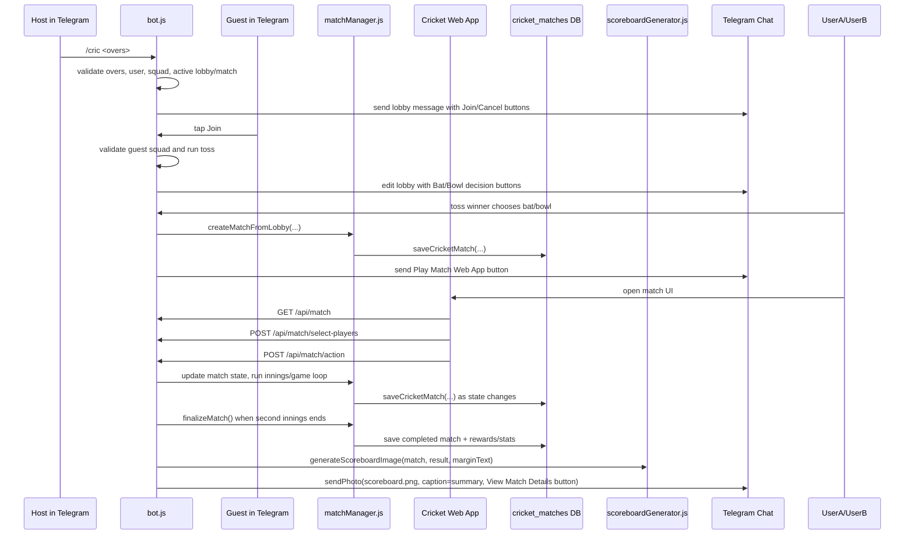

# `/cric` Match Summary to Telegram Mechanism

This document explains how the Telegram `/cric` command starts a cricket match and how the completed match summary is sent back to the Telegram chat.

## Purpose

`/cric` creates a player-vs-player cricket match lobby in a Telegram chat. After both players join, choose toss decisions, and complete the match in the Cricket Web App, the bot finalizes the match and sends a match summary back to the same Telegram chat as either:

1. a scoreboard image with a caption and "View Match Details" button, or
2. a fallback text message if scoreboard rendering or photo sending fails.

## Main Files Involved

| File | Responsibility |
| --- | --- |
| `bot.js` | Telegram command/callback handling, Web App API routes, game-loop orchestration, final Telegram summary send. |
| `game/matchManager.js` | Cricket match state model, active/completed match maps, match creation from lobby, persistence calls, match finalization. |
| `game/scoreboardGenerator.js` | Creates the PNG scoreboard used in the final Telegram summary. |
| `db/supabase.js` | Persists and reloads `cricket_matches` rows. |
| `public/cricket/app.js` | Frontend Cricket Web App that calls the `/api/match` endpoints. |

## End-to-End Flow



## Detailed Mechanism

### 1. `/cric` command creates the lobby

The `/cric` command accepts an optional overs argument:

```text
/cric <overs>
```

Important validation and setup steps:

- Defaults to `1` over when no argument is supplied.
- Rejects non-numeric values and values outside `1` to `20` overs.
- Ensures the host user exists in the database when Supabase/Neon is configured.
- Loads the host's cricket squad and saved cricket team name.
- Uses `ai.selectValidPlayingXI(...)` to require a valid XI before creating a lobby.
- Rejects lobby creation when the host already has an active match/lobby or the chat already has a waiting lobby.
- Stores the lobby in the in-memory `activeLobbies` object using `ctx.chat.id` as the key.
- Sends a Telegram lobby message with `Join` and `Cancel` inline buttons.

### 2. Guest joins the lobby

When another user taps `Join`, the `cric_join` callback:

- Verifies there is an active lobby in the chat.
- Rejects the host joining their own lobby.
- Rejects duplicate guests.
- Rejects users already in another active match/lobby.
- Ensures the guest user exists in the database.
- Loads the guest squad and cricket team name.
- Validates the guest XI with `ai.selectValidPlayingXI(...)`.
- Randomly chooses the toss winner.
- Edits the original lobby message into a toss decision message with `Bat First` and `Bowl First` buttons.

### 3. Toss decision creates the persisted match

When the toss winner chooses `bat` or `bowl`, the `cric_decision:*` callback:

- Verifies only the toss winner can make the decision.
- Sets `lobby.battingPlayer` and `lobby.bowlingPlayer` according to the toss decision.
- Creates a database match id like `c_<timestamp>_<random>`.
- Calls `matchManager.createMatchFromLobby(...)`.
- Sets the match status to `xi_selection`.
- Sends a new Telegram message with a `Play Match` button.
- Deletes the lobby from `activeLobbies`.

`createMatchFromLobby(...)` builds a `Match` object with:

- `type: 'pvp'`
- `chatId` from the Telegram chat
- selected overs
- randomized pitch
- host and guest team data
- toss winner id and toss decision

It then stores the same match in `activeMatches` by host id, guest id, and match id, and persists the serialized state with `saveToDb(match)`.

### 4. Play Match button opens the Web App

The bot builds Web App/deep-link URLs with the match id and chat id:

- private chat: `https://<host>/cricket?match_id=<match.id>&chat_id=<match.chatId>` as a Telegram Web App button
- group chat: `https://t.me/<botUsername>/bonus?startapp=cricket_<match.id>_<match.chatId>` as a URL button

The Cricket Web App uses API endpoints in `bot.js` to fetch and mutate match state:

| Endpoint | Used for |
| --- | --- |
| `GET /api/match` | Loads active or persisted match state by `userId` or `matchId`. |
| `POST /api/match/select-players` | Confirms opening batsmen and bowler for innings setup. |
| `POST /api/match/action` | Sends bowling/batting selections and other match actions. |

### 5. Match state is serialized, persisted, and restored

The match state is kept in memory while active and is also persisted to the `cricket_matches` table.

Persistence path:

1. `matchManager.saveToDb(match)` serializes the match.
2. `db/supabase.js` upserts the row with `id`, `chat_id`, `host_id`, `guest_id`, `status`, `state_json`, and `updated_at`.
3. On API lookup, if the match is not in memory but a `matchId` is supplied, `bot.js` can load the row with `getCricketMatchById(...)`, deserialize it, and return it to the Web App.
4. On bot startup, `matchManager.loadActiveMatchesFromDb()` restores non-completed matches into `activeMatches`.

### 6. Game loop detects innings and match completion

`runGameLoopStep(...)` drives the match after player actions. When `match.checkInningsEnded()` returns true:

- If status is `innings1`:
  - an end-of-innings commentary entry is added,
  - a Telegram innings-complete message is sent for non-PvP modes,
  - `match.startSecondInnings()` is called,
  - the game loop continues for the second innings.
- If status is `innings2`:
  - `match.finalizeMatch()` is called,
  - final commentary is added,
  - margin text is calculated,
  - a Telegram match summary is prepared,
  - the scoreboard image is generated and sent to Telegram.

### 7. Finalization prepares result data and rewards

`match.finalizeMatch()` performs the result-side effects:

- Sets `match.status = 'completed'`.
- Determines winner/loser from innings scores and target chase.
- Calculates winner and loser coin rewards from `totalOvers`.
- Selects Man of the Match from the winning XI using `runs + wickets * 25`.
- Awards coins to non-AI winner/loser.
- Records win/loss statistics.
- Saves the completed match to the database.
- Removes the match from `activeMatches`.
- Temporarily caches the completed match in `completedMatches` for five minutes.
- Returns the result object used by the Telegram summary and scoreboard renderer.

### 8. Telegram match summary send

After finalization, `bot.js` builds:

- `marginText`, for example `won by 5 wickets` or `won by 12 runs`.
- `summary`, for example:

```html
🏆 <b>MATCH COMPLETED!</b>

🎉 <b>WinnerName</b> won by 5 wickets!
```

or, for a tie:

```html
🏆 <b>MATCH COMPLETED!</b>

🤝 <b>Match Tied!</b>
```

It also builds a `View Match Details` button:

- private chat: Web App button pointing to `/cricket?match_id=...&chat_id=...`
- group chat: Telegram deep link using `startapp=cricket_<match.id>_<match.chatId>`

The preferred send path is:

1. Call `generateScoreboardImage(match, result, marginText)`.
2. If it returns a PNG buffer, call `bot.api.sendPhoto(...)` with:
   - target chat: `match.chatId`
   - file: `scoreboard.png`
   - caption: `summary`
   - parse mode: `HTML`
   - inline keyboard: `View Match Details`
3. If image generation returns `null`, call `sendTelegramMessage(match, summary, { reply_markup })`.
4. If sending the image throws an error, log it and fall back to the same text summary.
5. If finalization itself throws, send a generic completion fallback message.

## Scoreboard Image Generation

`game/scoreboardGenerator.js` renders a 1024x576 PNG using `@napi-rs/canvas`. The generator:

- draws the stadium background from `assets/stadium_bg.png`, with a color fallback,
- renders a central broadcast-style card,
- labels the image `MATCH SUMMARY`,
- resolves the innings team names from `match.host`, `match.guest`, and innings batting ids,
- prints both innings scores,
- extracts top batting and bowling performers,
- draws winner/result information,
- returns `canvas.toBuffer('image/png')`, or `null` on error.

## Important Runtime State

| State | Location | Notes |
| --- | --- | --- |
| `activeLobbies` | `bot.js` | In-memory waiting lobby keyed by Telegram chat id. |
| `activeMatches` | `game/matchManager.js` | In-memory active matches keyed by host id, guest id, and match id. |
| `completedMatches` | `game/matchManager.js` | Temporary completed-match cache keyed by match id and players for five minutes. |
| `cricket_matches.state_json` | Database | Serialized source used to restore/retrieve match state. |

## Failure and Fallback Behavior

- Invalid overs: replies with `/cric <overs (1-20)>` usage.
- Invalid host/guest XI: lobby creation or join fails with the XI validation error.
- Duplicate lobby/match: bot rejects the request before creating a new lobby/match.
- Missing in-memory match during API load: bot attempts database lookup by `matchId`.
- Scoreboard render failure: bot sends the text summary instead of a photo.
- Photo send failure: bot logs the send failure and sends the text summary.
- Finalization failure: bot sends a generic match-completed fallback message.

## Quick Trace: `/cric` to Telegram Summary

1. Host sends `/cric 2`.
2. Bot validates host squad and posts lobby.
3. Guest taps `Join`.
4. Bot validates guest squad and runs toss.
5. Toss winner chooses bat/bowl.
6. Bot creates persisted match and posts `Play Match` button.
7. Players open Cricket Web App and play through API actions.
8. Second innings ends.
9. Bot finalizes match, saves completed state, rewards players, calculates result.
10. Bot renders `scoreboard.png`.
11. Bot sends the final match summary to `match.chatId` using `sendPhoto(...)` with a details button.
12. If image/photo fails, bot sends the same summary as text.
